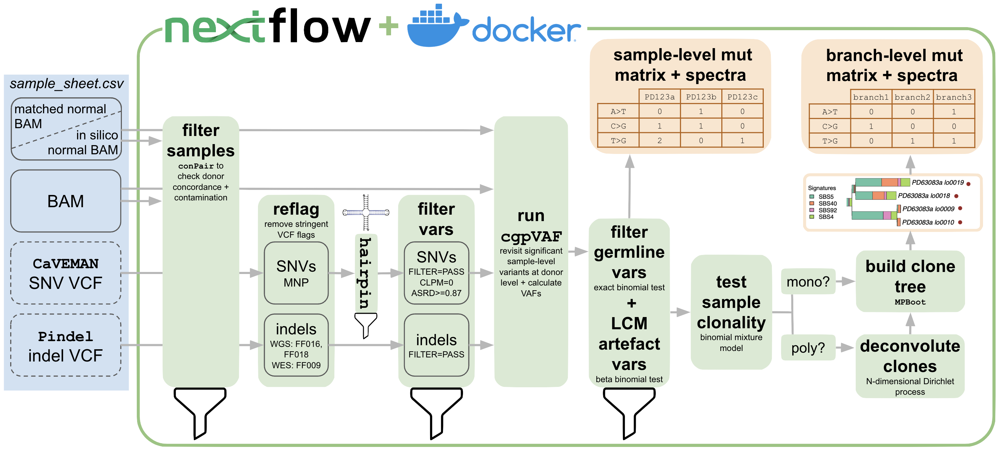

<h1>
  <picture>
    <source media="(prefers-color-scheme: dark)" srcset="docs/images/nf-core-lowinputtrees_logo_dark.png">
    
  </picture>
</h1>

[](https://github.com/nf-core/lowinputtrees/actions/workflows/ci.yml)
[](https://github.com/nf-core/lowinputtrees/actions/workflows/linting.yml)[](https://nf-co.re/lowinputtrees/results)[](https://doi.org/10.5281/zenodo.XXXXXXX)
[](https://www.nf-test.com)

[](https://www.nextflow.io/)
[](https://docs.conda.io/en/latest/)
[](https://www.docker.com/)
[](https://sylabs.io/docs/)
[](https://cloud.seqera.io/launch?pipeline=https://github.com/nf-core/lowinputtrees)

[](https://nfcore.slack.com/channels/lowinputtrees)[](https://twitter.com/nf_core)[](https://mstdn.science/@nf_core)[](https://www.youtube.com/c/nf-core)


# process_sanger_lcm-nf

## Introduction

`process_sanger_lcm-nf` is a [Nextflow](https://www.nextflow.io/) pipeline to process low-input DNA sequencing data, either from laser capture microdissection or from single-cell derived colonies. The pipeline include several sub-pipelines that can be run separately or together in different combinations, as follows.

1. [CONPAIR_FILTER_WITH_MATCH_NORMAL](https://github.com/Phuong-Le/process_sanger_lcm-nf/blob/nf-schema-phuong/workflows/conpair_filter_with_match_normal.nf), run when `params.conpair == true` (default): Use [conpair](https://github.com/nygenome/Conpair) to filter out contaminated samples.

- If a sample matches more than ONE match normal (defaul concordance threshold for matching: >= 90%), it is contaminated and filtered out of the input sample sheet.
- If a sample passes a contamination threshold (default >= 0.3%), it is filtered out. If a match normal passes a contamination threshold (default >= 5%), all of its matched samples are filtered out.

2. [FILTER_WITH_MATCH_NORMAL_SNV](https://github.com/Phuong-Le/process_sanger_lcm-nf/blob/nf-schema-phuong/workflows/filter_with_match_normal_snvs.nf), run when `params.filter_snv == true` (default). Filtering SNVs, taking vcf files generated by CaVEMAN. This workflow can be broken down into the following steps

- Initial filtering. Default initial filtering criteria can be found in [data/snv_default.filter](https://github.com/Phuong-Le/process_sanger_lcm-nf/blob/main/data/snv_default.filter).
- For each donor with multiple samples, use `cgpVAF` to calculate and pool VAF across their samples.
- Use beta-binomial test based on VAF to filter out LCM artefact mutations.
- Generate a mutation matrix using [SigProfilerMatrixGenerator](https://github.com/AlexandrovLab/SigProfilerMatrixGenerator)
- Plot the mutation matrix using [SigProfilerPlotting](https://github.com/AlexandrovLab/SigProfilerPlotting/tree/master)

3. [FILTER_WITH_MATCH_NORMAL_INDEL](https://github.com/Phuong-Le/process_sanger_lcm-nf/blob/nf-schema-phuong/workflows/filter_with_match_normal_indels.nf), run when `params.filter_indel == true` (default). Filtering INDELs, taking vcf files generated by Pindels. This workflow can be broken down into the following steps

- Initial filtering. Default initial filtering criteria can be found in [data/indel_default.filter](https://github.com/Phuong-Le/process_sanger_lcm-nf/blob/main/data/indel_default.filter).
- For each donor with multiple samples, use `cgpVAF` to calculate and pool VAF across their samples.
- Use beta-binomial test based on VAF to filter out LCM artefact mutations.
- Generate a mutation matrix using [SigProfilerMatrixGenerator](https://github.com/AlexandrovLab/SigProfilerMatrixGenerator)
- Plot the mutation matrix using [SigProfilerPlotting](https://github.com/AlexandrovLab/SigProfilerPlotting/tree/master)

4. [PHYLOGENETICS](https://github.com/Phuong-Le/process_sanger_lcm-nf/blob/nf-schema-phuong/workflows/phylogenetics.nf) for SNVs, run when `params.phylogenetics == true` (default) and `params.filter_snv == true`, or `params.phylogenetics == true` and `params.with_topology == false`.

- For each donor pd_id, use NR (reads supporting variant), NV (total depths) and the binary genotype file (outputs from FILTER_WITH_MATCH_NORMAL_SNV, otherwise should specified in the sample sheet) to create a fasta file of aligned sequences, where each sequence represents a sample of a donor.
- From the fasta file representing each donor, create a phylogenetic tree using MPBoot.
- Assign mutations to each branch of the tree
- For each donor, generate a mutation matrix for the branches using [SigProfilerMatrixGenerator](https://github.com/AlexandrovLab/SigProfilerMatrixGenerator)
- Plot the mutation matrices using [SigProfilerPlotting](https://github.com/AlexandrovLab/SigProfilerPlotting/tree/master)

5. [PHYLOGENETICS_PROVIDED_TREE_TOPOLOGY](https://github.com/Phuong-Le/process_sanger_lcm-nf/blob/nf-schema-phuong/workflows/phylogenetics_provided_topology.nf) for Indels, run when `params.phylogenetics == true` (default) and `params.filter_indel == true`, or `params.phylogenetics == true` and `params.with_topology == true`.

- For each donor pd_id, use NR (reads supporting variant), NV (total depths), the binary genotype file (outputs from FILTER_WITH_MATCH_NORMAL_INDEL) and a tree topology (output from PHYLOGENETICS). If FILTER_WITH_MATCH_NORMAL_INDEL and PHYLOGENETICS are not run, these files should specified in the sample sheet.
- Assign mutations to each branch of the tree (output from PHYLOGENETICS for SNVs or provided in sample sheet)
- For each donor, generate a mutation matrix for the branches using [SigProfilerMatrixGenerator](https://github.com/AlexandrovLab/SigProfilerMatrixGenerator)
- Plot the mutation matrices using [SigProfilerPlotting](https://github.com/AlexandrovLab/SigProfilerPlotting/tree/master)

This pipeline is ready to use, but still in active development. The full set of features that we *hope* to implement is illustrated below.



## Dependencies

- [Nextflow](https://www.nextflow.io/)
- [hairpin](https://github.com/cancerit/hairpin-wrapper) (wrapper by CASM IT at the Wellcome Sanger institute)
- [vcfilter]() (wrapper by CASM IT at the Wellcome Sanger institute, public repo coming soon)
- [tabix](https://www.htslib.org/doc/tabix.html)
- [cgpVAFcommand](https://github.com/cancerit/vafCorrect/tree/dev)
- [R](https://www.r-project.org/)

## Installation

Clone this repository, including the MutationsPy submodule

```
git clone git@github.com:Phuong-Le/process_sanger_lcm-nf.git
```

## Usage

### samplesheet.csv

First, prepare a samplesheet with your input data. Demo samplesheets for SNVs and indels can be found in the `demo_files/` directory. The samplesheet can be in either CSV or TSV format.

##### Conpair pipeline

Conpair pipeline (`params.conpair==true`) requires the following columns `sample_id`, `match_normal_id`, `pdid`, `bam`, `bai`, `bam_match `, and `bai_match`.

##### Filter SNVs

If Filter SNVs is run (`params.filter_snv==true`), samplesheet must include the additional columns `vcf_snv`, `vcf_tbi_snv`, `bas`, and `met`. It should look something like this:

| sample_id       | match_normal_id | pdid    | bam_match                    | bai_match                        | vcf_snv                                                | vcf_tbi_snv                                                | bam                                 | bai                                     | bas                                     | met                                        |
| --------------- | --------------- | ------- | ---------------------------- | -------------------------------- | ------------------------------------------------------ | ---------------------------------------------------------- | ----------------------------------- | --------------------------------------- | --------------------------------------- | ------------------------------------------ |
| PD47151n_lo0002 | PD47151b        | PD47151 | path/to/PD47151/PD47151b.bam | path/to/PD47151/PD47151b.bam.bai | path/to/PD47151/PD47151n_lo0002.caveman_c.annot.vcf.gz | path/to/PD47151/PD47151n_lo0002.caveman_c.annot.vcf.gz.tbi | path/to/PD47151/PD47151n_lo0002.bam | path/to/PD47151/PD47151n_lo0002.bam.bai | path/to/PD47151/PD47151n_lo0002.bam.bas | path/to/PD47151/PD47151n_lo0002.bam.met.gz |
| PD47151n_lo0004 | PD47151b        | PD47151 | path/to/PD47151/PD47151b.bam | path/to/PD47151/PD47151b.bam.bai | path/to/PD47151/PD47151n_lo0004.caveman_c.annot.vcf.gz | path/to/PD47151/PD47151n_lo0004.caveman_c.annot.vcf.gz.tbi | path/to/PD47151/PD47151n_lo0004.bam | path/to/PD47151/PD47151n_lo0004.bam.bai | path/to/PD47151/PD47151n_lo0004.bam.bas | path/to/PD47151/PD47151n_lo0004.bam.met.gz |
| PD52103n_lo0002 | PD52103b        | PD52103 | path/to/PD52103/PD52103b.bam | path/to/PD52103/PD52103b.bam.bai | path/to/PD52103/PD52103n_lo0002.caveman_c.annot.vcf.gz | path/to/PD52103/PD52103n_lo0002.caveman_c.annot.vcf.gz.tbi | path/to/PD52103/PD52103n_lo0002.bam | path/to/PD52103/PD52103n_lo0002.bam.bai | path/to/PD52103/PD52103n_lo0002.bam.bas | path/to/PD52103/PD52103n_lo0002.bam.met.gz |

##### Filter Indels

If Filter Indels is run, the samplesheet must include the additional columns `vcf_indel` and `vcf_tbi_indel`. It should look something like this:

| sample_id       | match_normal_id | pdid    | bam_match                    | bai_match                        | vcf_indel                                           | vcf_tbi_indel                                           | bam                                 | bai                                     |
| --------------- | --------------- | ------- | ---------------------------- | -------------------------------- | --------------------------------------------------- | ------------------------------------------------------- | ----------------------------------- | --------------------------------------- |
| PD47151n_lo0002 | PD47151b        | PD47151 | path/to/PD47151/PD47151b.bam | path/to/PD47151/PD47151b.bam.bai | path/to/PD47151/PD47151n_lo0002.pindel.annot.vcf.gz | path/to/PD47151/PD47151n_lo0002.pindel.annot.vcf.gz.tbi | path/to/PD47151/PD47151n_lo0002.bam | path/to/PD47151/PD47151n_lo0002.bam.bai |
| PD47151n_lo0004 | PD47151b        | PD47151 | path/to/PD47151/PD47151b.bam | path/to/PD47151/PD47151b.bam.bai | path/to/PD47151/PD47151n_lo0004.pindel.annot.vcf.gz | path/to/PD47151/PD47151n_lo0004.pindel.annot.vcf.gz.tbi | path/to/PD47151/PD47151n_lo0004.bam | path/to/PD47151/PD47151n_lo0004.bam.bai |
| PD52103n_lo0002 | PD52103b        | PD52103 | path/to/PD52103/PD52103b.bam | path/to/PD52103/PD52103b.bam.bai | path/to/PD52103/PD52103n_lo0002.pindel.annot.vcf.gz | path/to/PD52103/PD52103n_lo0002.pindel.annot.vcf.gz.tbi | path/to/PD52103/PD52103n_lo0002.bam | path/to/PD52103/PD52103n_lo0002.bam.bai |

##### PHYLOGENETICS

If phylogenetics is run (`params.phylogenetics==true`), there are three scenarios:

1. If Filter SNV has been previously run, phylogenetics is run for SNVs, there is no additional column requirements than Filter SNV
2. If Filter INDEL has been previously run, phylogenetics is run for INDELs.

- If Filter SNV has also been previously run, same as 1
- If Filter SNV has not been run, a column for tree topology is needed

| sample_id       | match_normal_id | pdid    | bam_match                    | bai_match                        | bam                                 | bai                                     | bas                                     | met                                        | topology                  |  |  |
| --------------- | --------------- | ------- | ---------------------------- | -------------------------------- | ----------------------------------- | --------------------------------------- | --------------------------------------- | ------------------------------------------ | ------------------------- | - | - |
| PD47151n_lo0002 | PD47151b        | PD47151 | path/to/PD47151/PD47151b.bam | path/to/PD47151/PD47151b.bam.bai | path/to/PD47151/PD47151n_lo0002.bam | path/to/PD47151/PD47151n_lo0002.bam.bai | path/to/PD47151/PD47151n_lo0002.bam.bas | path/to/PD47151/PD47151n_lo0002.bam.met.gz | path/to/PD47151n.treefile |  |  |
| PD47151n_lo0004 | PD47151b        | PD47151 | path/to/PD47151/PD47151b.bam | path/to/PD47151/PD47151b.bam.bai | path/to/PD47151/PD47151n_lo0004.bam | path/to/PD47151/PD47151n_lo0004.bam.bai | path/to/PD47151/PD47151n_lo0004.bam.bas | path/to/PD47151/PD47151n_lo0004.bam.met.gz | path/to/PD47151n.treefile |  |  |
| PD52103n_lo0002 | PD52103b        | PD52103 | path/to/PD52103/PD52103b.bam | path/to/PD52103/PD52103b.bam.bai | path/to/PD52103/PD52103n_lo0002.bam | path/to/PD52103/PD52103n_lo0002.bam.bai | path/to/PD52103/PD52103n_lo0002.bam.bas | path/to/PD52103/PD52103n_lo0002.bam.met.gz | path/to/PD52103n.treefile |  |  |

3. If neither Filter SNV nor Filter Indel has been run,

- If a tree topology needs to be calculated before assigning mutations to the branches (`params.with_topology==false`, this is assumed for SNV), the required columns are `pdid`, `nr_path`, `nv_path` and `genotype_bin`. For example

| pdid    | nr_path                                    | nv_path                                    | genotype_bin                     |
| ------- | ------------------------------------------ | ------------------------------------------ | -------------------------------- |
| PD47151 | path/to/PD47151/NR_somatic_noartefacts.txt | path/to/PD47151/NV_somatic_noartefacts.txt | path/tp/PD47151/genotype_bin.txt |
| PD52103 | path/to/PD52103/NR_somatic_noartefacts.txt | path/to/PD52103/NV_somatic_noartefacts.txt | path/tp/PD52103/genotype_bin.txt |

- If a tree topology is specified to not be calculated (`params.with_topology==false`, this is assumed for Indels), the required columns are `pdid`, `nr_path`, `nv_path`, `genotype_bin` and `topology`. For example

| pdid    | nr_path                                    | nv_path                                    | genotype_bin                     | topology                 |
| ------- | ------------------------------------------ | ------------------------------------------ | -------------------------------- | ------------------------ |
| PD47151 | path/to/PD47151/NR_somatic_noartefacts.txt | path/to/PD47151/NV_somatic_noartefacts.txt | path/tp/PD47151/genotype_bin.txt | path/to/PD47151.treefile |
| PD52103 | path/to/PD52103/NR_somatic_noartefacts.txt | path/to/PD52103/NV_somatic_noartefacts.txt | path/tp/PD52103/genotype_bin.txt | path/to/PD47151.treefile |

Each row represents one sample to be run through the pipeline.

**N.B.** Sample IDs should be unique. VCF files must gzipped, with the extension `*.vcf.gz`. Additionally, due to `cgpVAF` requirements, the name of the BAM files (`bam`, `bam_match`) should be in the form `<sample_id>.bam `and BAI files (`bai`, `bai_match`) in the form `<sample_id>.bam.bai`. These constraints may be lifted soon (see **Future work**).

### Running the pipeline

Now, you can run the pipeline using:

```
nextflow run process_sanger_lcm-nf \
    --samplesheet /path/to/samplesheet.csv \
    --mut_type snv \
    --reference_genome /path/to/genome.fa \
    --high_depth_bed /path/to/HiDepth.bed.gz \
    --outdir out/
```

### Running the pipeline on Sanger's Farm

If you are running this pipeline from the Wellcome Sanger Institute HPC cluster ('the farm'), you can run the pipeline as follows:

```
# load modules
module load nextflow/23.10.1-5891
module load hairpin/1.0.6
module load vcfilter/1.0.4
module load tabix/1.13
module load cgpVAFcommand/2.5.0
module load R/4.1.0

# run the pipeline from a head or interactive node
nextflow run /path/to/process_sanger_lcm-nf \
  -c conf/sanger_lsf.config \
  --samplesheet samplesheet.csv \
  --mut_type snv \
  --reference_genome /path/to/reference_data/hg38/genome.fa \
  --high_depth_bed /path/to/reference_data/hg38/highdepth.bed.gz \
  --outdir out/

# run the pipeline from a compute node
bsub \
  -cwd "./" \
  -o log/%J.${mut_type}.out \
  -e log/%J.${mut_type}.err \
  -R "select[mem>5000] rusage[mem=5000]" -M5000 \
  "nextflow run /path/to/process_sanger_lcm-nf -c conf/sanger_lsf.config --samplesheet samplesheet.csv --mut_type snv --reference_genome /path/to/reference_data/hg38/genome.fa --high_depth_bed /path/to/reference_data/hg38/highdepth.bed.gz --outdir out/"

```

**N.B.** This pipeline (particularly the configuration in `conf/sanger_lsf.config`) has only be tested on non-malignant colon data (~2,000-9,000 mutations per sample). If you have a bigger dataset, you may need to experiment with different resource allocation settings.

### All parameters

In order to view all available parameters, their types, descriptions and defaults, please use the `--help` argument.

```
$ nextflow run process_sanger_lcm-nf --help 

 N E X T F L O W   ~  version 24.04.4

Launching `./main.nf` [boring_lumiere] DSL2 - revision: 91dc7941f3

Typical pipeline command:

  nextflow run process_sanger_lcm-nf \
    --samplesheet /path/to/samplesheet.csv \
    --mut_type snv \
    --reference_genome /path/to/genome.fa \
    --high_depth_bed /path/to/HiDepth.bed.gz \
    --outdir out/

Input/output options
  --samplesheet                     [string]  A file that contains paths to relevant files for the processes in the pipeline, with headers similar to 
                                               demo_files/lcm_processing_input_indel.tsv for Indels or demo_files/lcm_processing_input_snv.tsv for SNVs. 
  --reference_genome                 [string]  Path to the reference genome fasta file.
  --with_match_normal                [boolean] Samples are provided a match normal that is not a synthetic genome [default: true]
  --outdir                           [string]  The output directory where the results will be saved. You have to use absolute paths to storage on Cloud 
                                               infrastructure. 
  --help                             [boolean] Return pipeline options and example command.

Conpair options
  --conpair                          [boolean] Run Conpair? [default: true]
  --marker_bed                       [string]  null
  --marker_txt                       [string]  null
  --concordance_threshold            [integer] the threshold (0-100) above which two samples are considered to be from the same donor [default: 90]
  --contamination_threshold_samples  [number]  the threshold (0-100) above which a sample is considered contaminated [default: 0.3]
  --contamination_threshold_match    [integer] the threshold (0-100) above which a match normal sample is considered contaminated [default: 5]

SNV filtering options
  --filter_snv                       [boolean] Filter SNVs? [default: true]

Indel filtering options
  --filter_indel                     [boolean] Filter indels? [default: true]

vcfilter options
  --vcfilter_config                  [string]  Pre-cgpVAF filtering. Defaults to data/indel_default.filter for Indels and data/snv_default.filter for 
                                               SNVs. 

cgpVAF options
  --high_depth_bed                   [string]  Path to a reference BED file of high depth regions.

Phylogenetics options
  --phylogenetics                    [boolean] Build a phylogenetic tree from the mutations? [default: true]
  --with_topology                    [boolean]  Only relevant and required if phylogenetics pipeline is requested without running filter SNV or filter Indels
  --phylogenetics_outdir_basename    [string]  Only relevant if phylogenetics pipeline is requested without running filter SNV or filter Indels, default to `/path/to/outdir/phylogenetics_snv` if `--with_topology false` and `path/to/outdir/phylogenetics_indel` if `--with_topology true`

```

## Authors

[Phuong Le](https://github.com/Phuong-Le) (al35@sanger.ac.uk)

[Rashesh Sanghvi](https://github.com/Rashesh7) (rs30@sanger.ac.uk)

[Alex Tidd](https://github.com/alextidd) (at31@sanger.ac.uk)

Chuling Ding (cd23@sanger.ac.uk)

## Future work

* [ ] Improve cgpVAF runtime by parallelising computation by chromosome and/or batches of samples.
* [ ] Resolve the constraints on the file names in the input (see N.B. in `samplesheet.csv` section).
* [ ] Complete parameter descriptions and interactions in `nextflow_schema.json`.
* [ ] Update hairpin to hairpin2.
* [ ] Containerise all steps so that the pipeline will run off-farm.
* [ ] Add VCF reflagging.
* [ ] Change from cgpVAF to bamtoR-based VAF calculation.
* [ ] Add description of where to get the `marker_bed` and `marker_txt` files for Conpair.

## Acknowledgements

Thanks to Chloe Pacyna and Yichen Wang for guiding me through the necessary steps to process LCM data.

Thanks to Shriram Bhosle from CASM IT for showing me how to use cgpVaf (ie vafCorrect).

The BetaBinomial filtering of germline and artefacts was adapted from [code written by Tim Coorens](https://github.com/TimCoorens/Unmatched_NormSeq/tree/master).

## NFCORE README

## Introduction

**nf-core/lowinputtrees** is a bioinformatics pipeline that ...

<!-- TODO nf-core:
   Complete this sentence with a 2-3 sentence summary of what types of data the pipeline ingests, a brief overview of the
   major pipeline sections and the types of output it produces. You're giving an overview to someone new
   to nf-core here, in 15-20 seconds. For an example, see https://github.com/nf-core/rnaseq/blob/master/README.md#introduction
-->

<!-- TODO nf-core: Include a figure that guides the user through the major workflow steps. Many nf-core
     workflows use the "tube map" design for that. See https://nf-co.re/docs/contributing/design_guidelines#examples for examples.   -->
<!-- TODO nf-core: Fill in short bullet-pointed list of the default steps in the pipeline -->


2. Present QC for raw reads ([`MultiQC`](http://multiqc.info/))

## Usage

> [!NOTE]
> If you are new to Nextflow and nf-core, please refer to [this page](https://nf-co.re/docs/usage/installation) on how to set-up Nextflow. Make sure to [test your setup](https://nf-co.re/docs/usage/introduction#how-to-run-a-pipeline) with `-profile test` before running the workflow on actual data.

<!-- TODO nf-core: Describe the minimum required steps to execute the pipeline, e.g. how to prepare samplesheets.
     Explain what rows and columns represent. For instance (please edit as appropriate):

First, prepare a samplesheet with your input data that looks as follows:

`samplesheet.csv`:

```csv
sample,fastq_1,fastq_2
CONTROL_REP1,AEG588A1_S1_L002_R1_001.fastq.gz,AEG588A1_S1_L002_R2_001.fastq.gz
```

Each row represents a fastq file (single-end) or a pair of fastq files (paired end).

-->

Now, you can run the pipeline using:

<!-- TODO nf-core: update the following command to include all required parameters for a minimal example -->

```bash
nextflow run nf-core/lowinputtrees \
   -profile <docker/singularity/.../institute> \
   --input samplesheet.csv \
   --outdir <OUTDIR>
```

> [!WARNING]
> Please provide pipeline parameters via the CLI or Nextflow `-params-file` option. Custom config files including those provided by the `-c` Nextflow option can be used to provide any configuration _**except for parameters**_; see [docs](https://nf-co.re/docs/usage/getting_started/configuration#custom-configuration-files).

For more details and further functionality, please refer to the [usage documentation](https://nf-co.re/lowinputtrees/usage) and the [parameter documentation](https://nf-co.re/lowinputtrees/parameters).

## Pipeline output

To see the results of an example test run with a full size dataset refer to the [results](https://nf-co.re/lowinputtrees/results) tab on the nf-core website pipeline page.
For more details about the output files and reports, please refer to the
[output documentation](https://nf-co.re/lowinputtrees/output).

## Credits

nf-core/lowinputtrees was originally written by Anh Phuong Le, Rashesh Sanghvi, Alex Tidd, Chuling Ding

We thank the following people for their extensive assistance in the development of this pipeline:

Alex Byrne, Raul Alacantra Aragon.

<!-- TODO nf-core: If applicable, make list of people who have also contributed -->

## Contributions and Support

If you would like to contribute to this pipeline, please see the [contributing guidelines](.github/CONTRIBUTING.md).

For further information or help, don't hesitate to get in touch on the [Slack `#lowinputtrees` channel](https://nfcore.slack.com/channels/lowinputtrees) (you can join with [this invite](https://nf-co.re/join/slack)).

## Citations

<!-- TODO nf-core: Add citation for pipeline after first release. Uncomment lines below and update Zenodo doi and badge at the top of this file. -->
<!-- If you use nf-core/lowinputtrees for your analysis, please cite it using the following doi: [10.5281/zenodo.XXXXXX](https://doi.org/10.5281/zenodo.XXXXXX) -->

<!-- TODO nf-core: Add bibliography of tools and data used in your pipeline -->

An extensive list of references for the tools used by the pipeline can be found in the [`CITATIONS.md`](CITATIONS.md) file.

You can cite the `nf-core` publication as follows:

> **The nf-core framework for community-curated bioinformatics pipelines.**
>
> Philip Ewels, Alexander Peltzer, Sven Fillinger, Harshil Patel, Johannes Alneberg, Andreas Wilm, Maxime Ulysse Garcia, Paolo Di Tommaso & Sven Nahnsen.
>
> _Nat Biotechnol._ 2020 Feb 13. doi: [10.1038/s41587-020-0439-x](https://dx.doi.org/10.1038/s41587-020-0439-x).
